# DES (Data Encryption Standard)

## 1 Introduction to DES
- DES (Data Encryption Standard) là chuẩn mã hóa dữ liệu đầu tiên trên thế giới, do Cơ quan an ninh Quốc gia Hoa Kỳ (NSA) đề xuất trên cơ sở cải tiến thuật toán Lucifer do hãng IBM công bố năm 1964. DES đã được sử dụng rộng rãi ở Hoa Kỳ và nhiều quốc gia khác trong các thập kỷ 70, 80, 90 cho đến khi được thay thế bởi Tiêu chuẩn mã hóa dữ liệu tiên tiến AES (Advanced Encryption Standard) vào năm 2002.
  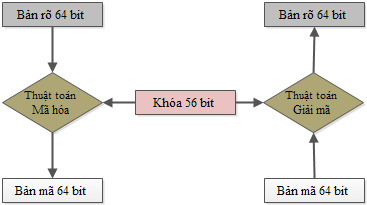  
- Đầu vào của DES là khối 64 bit, đầu ra cũng là khối 64 bit. Khóa mã hóa có độ dài 56 bit, nhưng thực chất ban đầu là 64 bit, được lấy đi các bit ở vị trí chia hết cho 8 dùng để kiểm tra tính chẵn lẻ.
## 2 DES algorithm:

### 2.1 DES-encipher algorithm:

DES là thuật toán mã hóa theo khối, nó xử lý từng khối thông tin của bản rõ có độ dài xác định là 64 bit. Trước khi đi vào 16 chu trình chính, khối dữ liệu cần bảo mật sẽ được tách ra thành từng khối 64 bit, và từng khối 64 bit này sẽ lần lượt được đưa vào 16 vòng mã hóa DES để thực hiện. Input: Bản rõ M = m1m2…m64 là một khối 64 bit, khóa 64 bit K = k1k2…k64. Output: Bản mã 64 bit C = c1c2… c64

* Bước 1: Sinh khóa con: Sử dụng thuật toán sinh khóa con từ khóa K ta sẽ được 16 khóa con K1, K2, … K16
* Bước 2: Sử dụng phép hoán vị khởi đầu IP (Initial Permutation) để hoán vị các bit của M, kết quả nhận được chia thành 2 nửa là L0 = m63m62…m32, R0 = m31m30…m0.
* Bước 3: Với i chạy từ i = 1 đến 16 thực hiện: Tính các Li và Ri theo công thức: Li = Ri-1 Ri = Li-1 XOR f(Ri-1, Ki) trong đó f(Ri-1, Ki) = R(S(E(Ri-1) XOR Ki)). Việc tính f(Ri-1, Ki) sẽ được trình bày chi tiết ở phần sau.
* Bước 4: Đổi vị trí khối L16, R16 ta được khối R16L16 = b1b2…b64.
* Bước 5: Sử dụng phép hoán vị kết thúc FP(Final Permutation – nghịch đảo với hoán vị khởi đầu IP) ta thu được bản mã cần tìm : C = IP-1(b1b2…b64)
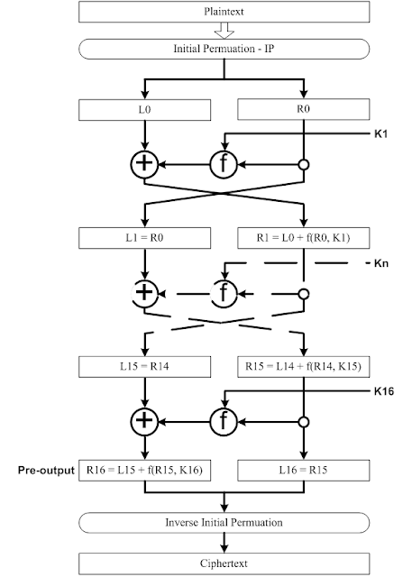  

### 2.2 Hoán vị khởi tạo-IP:
- Hoán vị là thay đổi ví trí các bit trong một chuỗi giá trị nhưng không làm thay đổi giá trị của các bit này. Đây là bước đầu tiên trong quy trình mã hóa dữ liệu. 64 bit dữ liệu đầu vào, gọi là plaintext, sẽ được hoán vị theo bảng mô tả sau đây.
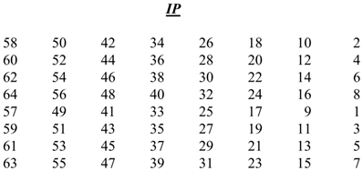  
- Chuỗi bit đầu vào được đánh số từ 1 đến 64 (tính từ trái qua phải). Sau đó, các bit này được thay đổi vị trí như sơ đồ IP, bit số 58 được đặt vào vị trí đầu tiên, bit số 50 được đặt vào vị trí thứ 2. Cứ như vậy, bit thứ 7 được đặt vào vị trí cuối cùng. 
Sau hoán vị, chuỗi bit mới được phân ra làm hai đoạn, mỗi đoạn 32 bit để bắt đầu vào quy trình tính toán mã hóa với key. Đoạn bên trái ký hiệu là L, đoạn bên phải ký hiệu là R. Đoạn L gồm các bit từ bit số 1 đến bit số 32, đoạn R gồm các bit từ bit số 33 đến bit số 64. Đoạn L của lần tính toán sau sẽ chính là đoạn R của lần tính toán trước. Đoạn R của lần tính toán sau sẽ được tính từ đoạn R trước đó qua hàm mã hóa f(R, K) rồi XOR với đoạn L của lần tính trước đó.
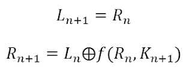

### 2.3 Hàm mã hóa f(R,K):

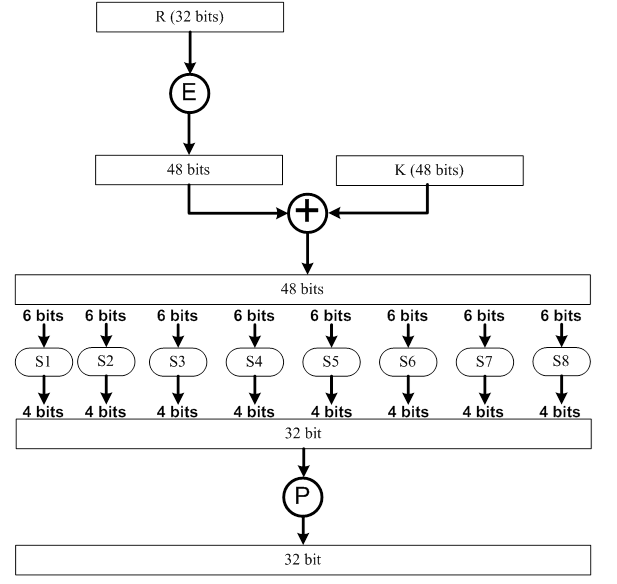  
- Đầu tiên, 32 bit của đoạn R được đánh số từ 1 đến 32 theo thứ tự từ trái qua phải. Giá trị này sẽ được chuyển đổi thông qua bảng tra E để tạo thành một giá trị 48 bit. Bit đầu tiên trong chuỗi giá trị 48 bit là bit số 32 của R, bit thứ 2 là bit số 1 của R, bit thứ 3 là bit số 2 của R và bit cuối cùng là bit số 1 của R.
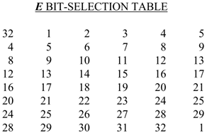  
- Sau khi tra bảng E, giá trị 48 bit được XOR với 48 bit của khóa vòng (cách tạo ra khóa vòng 48 bit sẽ được trình bày sau). Kết quả phép XOR được chia làm 8 block được đánh số từ 1 đến 8 theo thứ tự từ trái qua phải, mỗi block 6 bit. Mỗi block sẽ được biến đổi thông qua các hàm lựa chọn riêng biệt. Tương ứng với 8 block sẽ có 8 hàm chuyển đổi (selection function) riêng biệt là S1, S2, S3, S4, S5, S6, S7 và S8.
  
- Việc chuyển đổi giá trị của các hàm S1, S2, ..., S8 được thực hiện bằng cách tách block 6 bit thành hai phần. Phần thứ nhất là tổ hợp của bit đầu tiên và bit cuối cùng của block để tạo thành 2 bit chọn hàng của bảng S, bảng S có 4 hàng được đánh số từ 0 đến 3 theo thứ tự từ trên xuống. Phần thứ 2 là 4 bit còn lại dùng để chọn cột của bảng S, bảng S có 16 cột được đánh số từ 0 đến 15 theo thứ tự từ trái qua phải. Như vậy, với mỗi block 8 bit ta chọn được 1 giá trị trong bảng S. Giá trị này nằm trong khoảng từ 0 đến 15 sẽ được quy đổi thành chuỗi nhị phân 4 bit tương ứng. Các chuỗi nhị phân có được sau khi chuyển đổi từ S1 đến S8 sẽ được ghép lại theo thứ tự từ trái qua phải để tạo thành một giá trị 32 bit.
- Ví dụ về việc thực hiện chuyển đổi hàm S, giả sử, giá trị block 6 bit đầu tiên là 011011. Ta tách chuỗi này ra làm hai tổ hợp giá trị là 01 (bit đầu tiên và bit cuối cùng) và 1101 (4 bit ở giữa). Hai tổ hợp này được dùng để chọn hàng và cột tương ứng như hình minh họa sau:

  
- Tổ hợp 01 sẽ chọn hàng 1, tổ hợp 1101 sẽ chọn cột 13 và kết quả trả về là 5 có giá trị nhị phân 4 bit là 0101.
- Qua bước chuyển đổi với các hàm lựa chọn S, kết quả thu được là một giá trị 32 bit. Giá trị này được đưa qua một hàm hoán vị P để tạo ra giá trị hàm f.

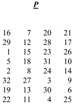  
- Giá trị 32 bit thu được từ các chuyển đổi với hàm lựa chọn S sẽ được đánh số từ 1 đến 32 theo thứ tự từ trái qua phải.
- Theo bảng hoán vị P, bit đầu tiên sau hoán vị sẽ là bit số 16, bit thứ 2 sẽ là bit số 7 và bit cuối cùng sẽ là bit số 25. Hàm tính toán mã hóa f(R, K) được định nghĩa như sau:
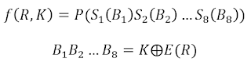  

Trong đó: 
* P(): là phép hoán vị P 
* Sn: là phép chuyển đổi block n (n chạy từ 1 đến 8) với hàm lựa chọn S 
* Bn: là block 6 bit thứ n (n chạy từ 1 đến 8). Block này lấy từ phép toán XOR giữa khóa vòng K và giá trị hàm E(R)
* E(R): là hàm chuyển đổi giá trị R 32 bit thành giá trị 48 bit

### 2.4 Tính khóa vòng - KS:
- Một key có 64 bit nhưng chỉ có 56 bit được sử dụng để thực hiện tính toán giá trị khóa vòng. Key được chia làm 8 byte. Các bit ở vị trí 8, 16, 32, 40, 48, 56 và 64 là các bit parity được sử dụng để kiểm tra độ chính xác của key theo từng byte vì khi key được phân phối trên đường truyền đến bộ mã hóa giải mã thì có thể xảy ra lỗi. Parity được sử dụng là parity lẻ (odd parity).
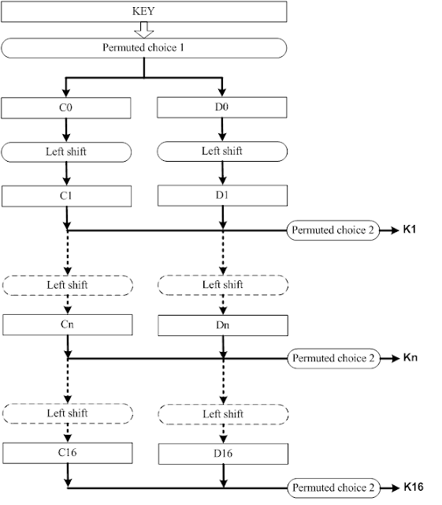  
- Key gốc sẽ được thực hiện hoán vị lựa chọn PC-1. Key được đánh số từ 1 đến 64 theo thứ tự từ trái qua phải.
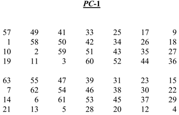  
- Bảng hoán vị lựa chọn PC-1 có hai phần. Phần đầu dùng để xác định giá trị C0 và phần sau dùng để xác định giá trị D0. Theo bảng trên thì C0 là chuỗi bit có thứ tự là 57, 49, 41, ..., 36 lấy từ key gốc, D0 là chuỗi bit có thứ tự là 63, 55, 47, ..., 4 lấy từ key gốc.
Sau khi xác định được giá trị ban đầu để tính key là C0 và D0 thì các khóa vòng Kn (với n từ 1 đến 16) sẽ được tính theo nguyên tắc giá trị của khóa vòng thứ n sẽ được tính từ giá trị khóa vòng thứ n-1.
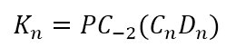  
- Trong đó Cn và Dn được tạo từ Cn-1 và Dn-1 bằng cách dịch trái các giá trị này với số bit được quy định trong bảng sau đây:
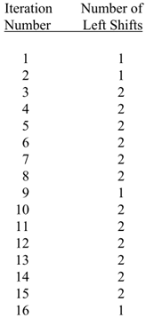  

- Sau khi tính được Cn và Dn thì chuỗi CnDn sẽ được đánh số từ 1 đến 56 theo thứ tự từ trái sang phải và được hoán vị lựa chọn lần 2 theo bảng hoán vị PC-2.
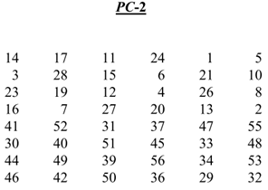  
- Như vậy bit đầu tiên của khóa vòng Kn là bit số 14 của chuỗi CnDn, bit thứ 2 là bit số 17 của chuỗi CnDn và bit cuối cùng là bit số 32 của chuỗi CnDn.

### 2.5 Hoán vị khởi tạo đảo IP-1:
- Đây là bước cuối cùng để tạo ra giá trị mã hóa. Giá trị của lần lặp mã hóa cuối cùng sẽ được hoán vị khởi tạo đảo IP-1 và tạo ra giá trị mã hóa plaintext.

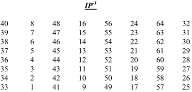  

## Design specification: ( continue...)
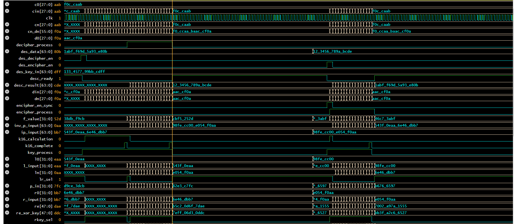  
